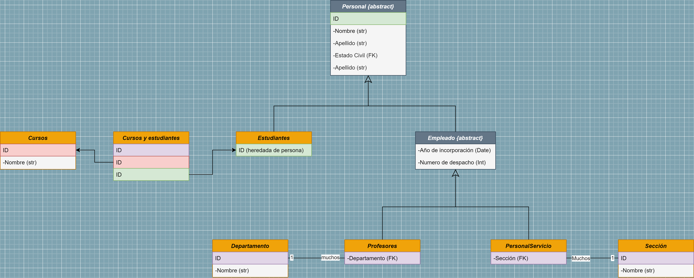
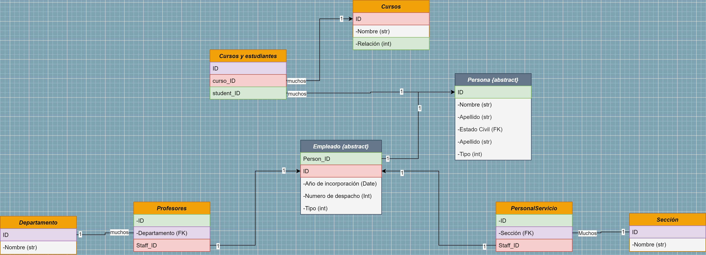

# Test Técnico Java - Sistema de Gestión de Facultad

Este repositorio contiene la solución a un test técnico ofrecido por PwC para el desarrollo de una aplicación de gestión de información para una facultad. La aplicación debe manejar datos sobre estudiantes, profesores y personal de servicio. Antes de iniciar el proyecto, asegúrate de realizar los siguientes pasos:

## Configuración de la Base de Datos

1. Crea una base de datos llamada "test_tecnico".
2. Utiliza el usuario "root" sin contraseña para acceder a la base de datos.
3. Configura la conexión de la base de datos con la siguiente información:
   - IP: localhost
   - Puerto: 3306

## Detalles del Proyecto

A continuación, se detalla la información que la aplicación debe gestionar para cada tipo de persona:

- **Persona:**
  - Nombre y apellidos.
  - Número de identificación.
  - Estado civil.

- **Empleado (hereda de Persona):**
  - Año de incorporación a la facultad.
  - Número de despacho asignado.

- **Estudiante (hereda de Persona):**
  - Curso en el que está matriculado.

- **Profesor (hereda de Empleado):**
  - Departamento al que pertenece (p. ej., lenguajes, matemáticas, arquitectura).

- **Personal de Servicio (hereda de Empleado):**
  - Sección a la que están asignados (p. ej., biblioteca, decanato, secretaría).

## Diagrama de Clases

El siguiente diagrama de clases representa la estructura de las clases y sus relaciones:

- **Student** hereda de **Person**.
- **Staff** hereda de **Person**.
- **Teacher** hereda de **Staff**.
- **ServiceStaff** hereda de **Staff**.

Adicionalmente, se presenta un diagrama de base de datos que ilustra las relaciones entre las entidades:

- **Student** mantiene una relación 1 a 1 con **Person**.
- **Staff** mantiene una relación 1 a 1 con **Person**.
- **Teacher** mantiene una relación 1 a 1 con **Staff**.
- **PersonalStaff** mantiene una relación 1 a 1 con **Staff**.

Además, se establecen relaciones adicionales:
- **Student** mantiene una relación muchos a muchos con **Courses** a través de una tabla intermedia.
- **Teacher** mantiene una relación muchos a 1 con **Department**.
- **PersonalStaff** mantiene una relación muchos a 1 con **Section**.

## Funcionalidades y Bonus

La implementación de las clases incluye los constructores y los siguientes métodos:

- Cambio del estado civil de una persona.
- Matriculación de un estudiante en un nuevo curso.
- Cambio de departamento de un profesor.
- Traslado de sección de un empleado del personal de servicio.

**Bonus:**
- Obtención de todos los profesores para algún departamento particular.
- Obtención de todos los estudiantes de un curso.

Adicionalmente, se han desarrollado tests que prueban la funcionalidad implementada mediante una interfaz gráfica para que resulte cómodo su uso.
